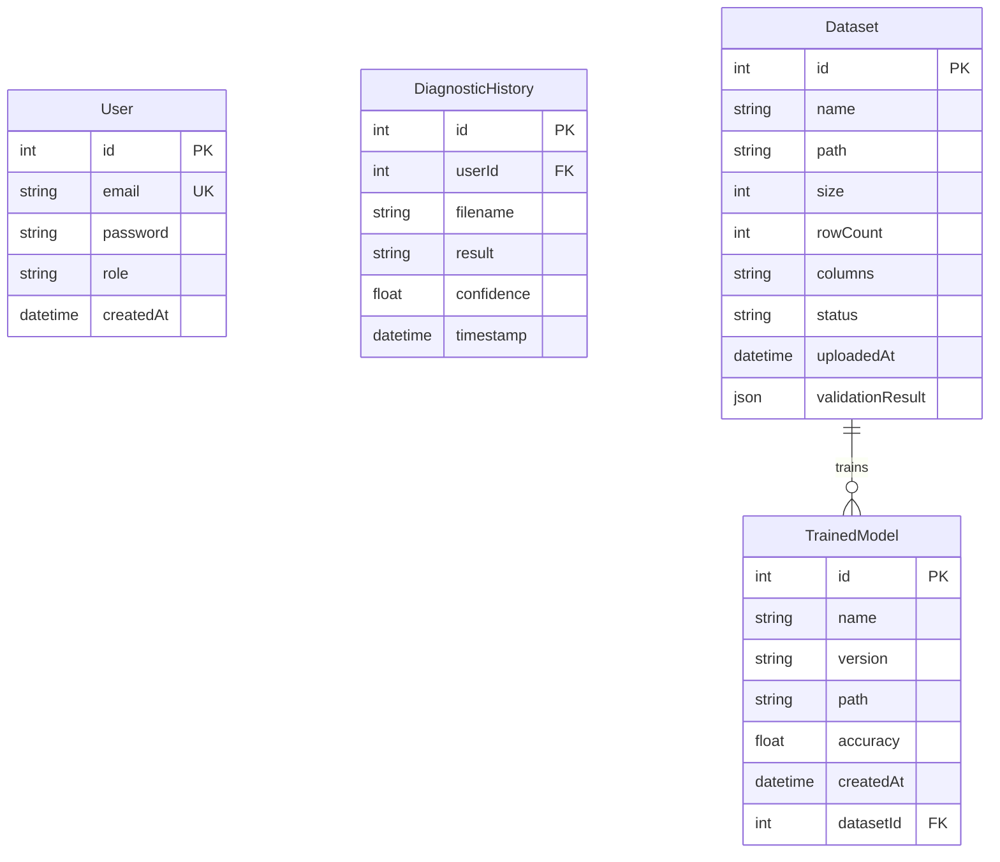

<p align="center">
  <h1 align="center">⚙️ BearingGuard Pro</h1>
  <p align="center">
    <strong>AI-Powered Bearing Fault Detection & Diagnostics System</strong>
  </p>
  <p align="center">
    <em>Production-grade vibration diagnostics dashboard using CNN, Random Forest & SHAP explainability</em>
  </p>
</p>

<p align="center">
  
  
  
  
  
  
  
</p>

---

## 📋 Table of Contents

- [Overview](#-overview)
- [System Architecture](#-system-architecture)
- [Key Features](#-key-features)
- [Project Structure](#-project-structure)
- [Prerequisites](#-prerequisites)
- [Installation & Setup](#-installation--setup)
- [API Endpoints](#-api-endpoints)
- [Database Schema](#-database-schema)
- [Tech Stack](#-tech-stack)

---

## 🎯 Overview

**BearingGuard Pro** is an AI-powered bearing fault detection system that analyzes vibration signals to detect and classify bearing conditions:

| Status | Description |
|:---:|---|
| ✅ **Normal** | Bearing is operating normally |
| ⚠️ **Inner Race Fault** | Defect detected on the inner race |
| 🔴 **Outer Race Fault** | Defect detected on the outer race |

The system uses a **CNN (Convolutional Neural Network)** combined with a **Random Forest** classifier for fault classification, along with **SHAP (SHapley Additive exPlanations)** to provide interpretable explanations — helping engineers understand **why** the AI made a specific diagnosis.

---

## 🏗 System Architecture

```
┌─────────────────────────────────────────────────────────────────────┐
│                        BearingGuard Pro                             │
├─────────────────┬──────────────────┬────────────────────────────────┤
│                 │                  │                                │
│   Frontend      │    Backend       │         AI Service             │
│   (Next.js)     │  (Express.js)    │        (FastAPI)               │
│                 │                  │                                │
│  • Dashboard    │  • Auth (JWT)    │  • CNN Model Training          │
│  • Login/Signup │  • Dataset Mgmt  │  • Random Forest Features      │
│  • Diagnostics  │  • Model Mgmt    │  • SHAP Explanations           │
│  • Training UI  │  • Diagnostics   │  • Dataset Validation          │
│  • Models Mgmt  │  • Admin Panel   │  • Kaggle Integration          │
│                 │                  │                                │
│   Port: 3000    │   Port: 3001     │    Port: 8000                  │
├─────────────────┴──────────────────┴────────────────────────────────┤
│                        SQLite (Prisma ORM)                          │
└─────────────────────────────────────────────────────────────────────┘

┌─────────────────────────────────────────────────────────────────────┐
│              Standalone App (Streamlit) — Port: 8501                │
│     Self-contained app with full training & diagnostics features    │
└─────────────────────────────────────────────────────────────────────┘
```

---

## ✨ Key Features

### 🔬 Field Diagnostics
- Upload CSV files containing vibration signal data
- Automatic classification: Normal / Inner Race Fault / Outer Race Fault
- Display **confidence score** for each prediction
- Explain results using **SHAP values** — visual charts showing which features influenced the decision most

### 🧠 Model Training
- Auto-download datasets from **Kaggle** or upload manually
- Dataset validation and profiling before training (using `ydata-profiling`)
- Full training pipeline with **real-time progress** via WebSocket/SSE
- Store and manage multiple model versions

### 📊 Dashboard & Visualization
- **Health Gauge**: Visual bearing health assessment
- **Feature Map**: Interactive feature visualization
- **Signal Chart**: Vibration signal waveform display
- **Training Metrics**: Real-time loss/accuracy tracking during training

### 🔐 User Management
- Register / Login with **JWT Authentication**
- Role-based access: **USER** and **ADMIN**
- Per-user diagnostic history tracking

---

## 📁 Project Structure

```
bearing-fault-vibration/
├── ai_service/                  # 🤖 AI Service (FastAPI)
│   ├── main.py                  #    Entry point — API endpoints
│   ├── requirements.txt         #    Python dependencies
│   └── core/
│       ├── config.py            #    Configuration (paths, hyperparameters)
│       ├── engine.py            #    AIEngine class — training & inference
│       └── features.py          #    Feature extraction utilities
│
├── backend/                     # 🖥 Backend Service (Express.js)
│   ├── package.json
│   ├── prisma/
│   │   ├── schema.prisma        #    Database schema definition
│   │   ├── dev.db               #    SQLite database file
│   │   └── migrations/          #    Database migrations
│   └── src/
│       ├── server.ts            #    Express server entry point
│       ├── auth/                #    JWT authentication middleware
│       └── routes/
│           ├── auth.routes.ts       # Register / Login
│           ├── admin.routes.ts      # Admin management
│           ├── dataset.routes.ts    # Upload & manage datasets
│           ├── model.routes.ts      # Manage trained models
│           └── diagnostics.routes.ts # Fault diagnostics
│
├── frontend/                    # 🌐 Frontend (Next.js 14)
│   ├── package.json
│   ├── tailwind.config.ts
│   └── app/
│       ├── layout.tsx           #    Root layout
│       ├── page.tsx             #    Landing page
│       ├── login/               #    Login page
│       ├── signup/              #    Sign-up page
│       └── dashboard/
│           ├── layout.tsx       #    Dashboard layout (sidebar)
│           ├── page.tsx         #    Dashboard home
│           ├── datasets/        #    Dataset management
│           ├── diagnostics/     #    Fault diagnostics
│           ├── models/          #    Model management
│           └── training/        #    Model training
│
├── components/                  # 🧩 React Components (Vite App)
│   ├── FileUpload.tsx           #    File upload component
│   ├── HealthGauge.tsx          #    Bearing health gauge
│   ├── FeatureMap.tsx           #    Feature map visualization
│   ├── SignalChart.tsx          #    Signal waveform chart
│   ├── Sidebar.tsx              #    Sidebar navigation
│   └── TrainingPanel.tsx        #    Training panel component
│
├── app.py                       # 🎯 Streamlit App (standalone)
├── App.tsx                      #    Root component (Vite app)
├── index.html                   #    HTML entry point (Vite app)
├── index.tsx                    #    React entry point
├── types.ts                     #    TypeScript type definitions
├── constants.ts                 #    App constants
├── package.json                 #    Root dependencies (Vite + React)
├── requirements.txt             #    Python dependencies (Streamlit app)
├── vite.config.ts               #    Vite configuration
└── tsconfig.json                #    TypeScript configuration
```

---

## 💻 Prerequisites

| Component | Requirement |
|---|---|
| **Python** | 3.10+ |
| **Node.js** | 18+ |
| **npm** | 9+ |
| **RAM** | 8GB+ (16GB recommended for training) |
| **GPU** | Optional (TensorFlow supports CPU) |

---

## 🚀 Installation & Setup

### 1️⃣ Clone the Repository

```bash
git clone https://github.com/<your-username>/bearing-fault-vibration.git
cd bearing-fault-vibration
```

### 2️⃣ AI Service (FastAPI)

```bash
cd ai_service
pip install -r requirements.txt
python main.py
```

> AI Service will run at `http://localhost:8000`

### 3️⃣ Backend (Express.js)

```bash
cd backend
npm install
npx prisma generate
npx prisma migrate dev
npm run dev
```

> Backend will run at `http://localhost:3001`

### 4️⃣ Frontend (Next.js)

```bash
cd frontend
npm install
npm run dev
```

> Frontend will run at `http://localhost:3000`

### 5️⃣ Streamlit App (Standalone — optional)

```bash
# From the root directory
pip install -r requirements.txt
streamlit run app.py
```

> Streamlit App will run at `http://localhost:8501`

### 6️⃣ Vite Dashboard (optional)

```bash
# From the root directory
npm install
npm run dev
```

> Vite App will run at `http://localhost:5173`

---

## 📡 API Endpoints

### AI Service (`http://localhost:8000`)

| Method | Endpoint | Description |
|---|---|---|
| `GET` | `/` | Health check & service status |
| `POST` | `/validate` | Validate dataset schema & generate profiling report |
| `POST` | `/download-kaggle` | Download dataset from Kaggle |
| `POST` | `/train` | Start model training (background task) |
| `POST` | `/train/stream` | Training with SSE real-time progress |
| `WS` | `/ws/training` | Training with WebSocket real-time progress |
| `GET` | `/train/history` | Get last training history |
| `POST` | `/load-model` | Load a specific model version |
| `POST` | `/inference` | Diagnose bearing fault from CSV file |

### Backend (`http://localhost:3001`)

| Method | Endpoint | Description |
|---|---|---|
| `POST` | `/api/auth/register` | Register a new account |
| `POST` | `/api/auth/login` | Login |
| `GET` | `/api/datasets` | List all datasets |
| `POST` | `/api/datasets/upload` | Upload a dataset |
| `POST` | `/api/diagnostics/analyze` | Run fault diagnostics |
| `GET` | `/api/models` | List trained models |
| `POST` | `/api/admin/promote` | Promote user to admin |

---

## 🗄 Database Schema



---

## 🛠 Tech Stack

### AI & Machine Learning
| Technology | Role |
|---|---|
| **TensorFlow / Keras** | Build and train CNN model |
| **scikit-learn** | Random Forest, StandardScaler, preprocessing |
| **SHAP** | Prediction explainability (Explainable AI) |
| **NumPy / Pandas** | Numerical data processing |
| **ydata-profiling** | Automated dataset profiling |

### Backend & API
| Technology | Role |
|---|---|
| **FastAPI** | AI Service API (async, WebSocket, SSE) |
| **Express.js** | Backend REST API |
| **Prisma ORM** | Database abstraction layer |
| **SQLite** | Data storage |
| **JWT** | Authentication & Authorization |
| **bcrypt** | Password hashing |

### Frontend & UI
| Technology | Role |
|---|---|
| **Next.js 14** | Frontend framework (App Router) |
| **React 18/19** | UI library |
| **Tailwind CSS** | Styling framework |
| **Recharts** | Charts and data visualization |
| **Framer Motion** | Animations |
| **Lucide React** | Icons |
| **Streamlit** | Standalone dashboard app |

### Others
| Technology | Role |
|---|---|
| **KaggleHub** | Download datasets from Kaggle |
| **Plotly** | Interactive charts (Streamlit) |
| **Matplotlib / Seaborn** | Static visualizations |
| **Vite** | Build tool for React dashboard |

---

## 📄 License

This project is developed for research and educational purposes.

---

<p align="center">
  <strong>BearingGuard Pro</strong> — Smart diagnostics, proactive maintenance 🔧
</p>
